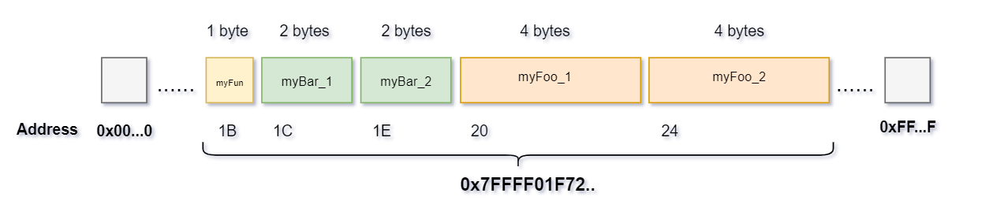

# Enum in C
**Reference:**
- https://www.pietrolc.com/size-of-enum-type/?adtref=1711419143461
## How is enum data stored in memory?
Enum data is typically stored in memory as integer values. Each enum value is assigned an integer that represents its position within the enum. When the program runs, these integer values are used to represent the enum values in memory. This allows for efficient storage and comparison of enum values within the program.

`Example:`

**Code**
~~~cpp
#include<iostream>
#include <cstdint>

enum foo
{
    typeA = 0,
    typeB,
    typeC
};

enum two : int8_t
{
    typeD = 0,
    typeE,
    typeF
};

enum bar : uint64_t
{
    typeG = 0,
    typeH,
    typeK
};
int main()
{
    std::cout << "Size of <foo> type variable: " << sizeof(foo) << " bytes" << std::endl;
    std::cout << "Size of <bar> type variable: " << sizeof(two) << " bytes" << std::endl;
    std::cout << "Size of <bar> type variable: " << sizeof(bar) << " bytes" << std::endl;
    return 0;
}
~~~
**Output:**
~~~cpp
Size of <foo> type variable: 4 bytes
Size of <two> type variable: 1 bytes
Size of <bar> type variable: 8 bytes
~~~
## Allocating enum memory in C
**Code**
~~~cpp
#include<iostream>
#include <cstdint> // dùng để sử dụng các kiểu dữ liệu init8_t, uint8_t, ....

enum foo // default data type: int
{
    typeA = 0,
    typeB,
    typeC
};

enum fun : int8_t
{
    typeD = 0,
    typeE,
    typeF
};

enum bar : uint16_t
{
    typeG = 0,
    typeH,
    typeK
};

int main()
{
    foo myFoo_1 = typeA; // Khai báo một biến thuộc kiểu enum foo
    foo myFoo_2 = typeB;
    fun myFun__ = typeD;
    bar myBar_1 = typeK;
    bar myBar_2 = typeG;

    std::cout << "Address of <myFoo_1>: " << &myFoo_1 << std::endl;
    std::cout << "Address of <myFoo_2>: " << &myFoo_2 << std::endl;
    std::cout << "Address of <myFun__>: " << &myFun__ << std::endl;
    std::cout << "Address of <myBar_1>: " << &myBar_1 << std::endl;
    std::cout << "Address of <myBar_2>: " << &myBar_2 << std::endl;
    
    return 0;
}
~~~
**Output:**
~~~cpp
Address of <myFoo_1>: 0x7ffff01f7220
Address of <myFoo_2>: 0x7ffff01f7224
Address of <myFun__>: 0x7ffff01f721b
Address of <myBar_1>: 0x7ffff01f721c
Address of <myBar_2>: 0x7ffff01f721e
~~~

    

